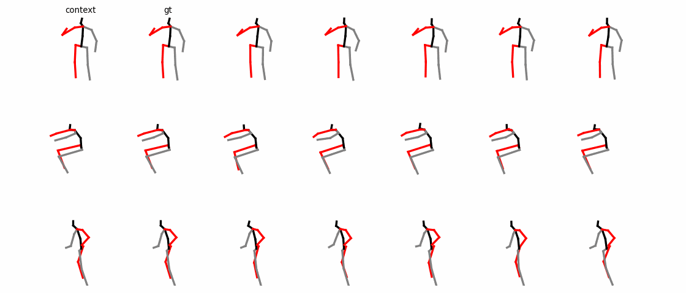
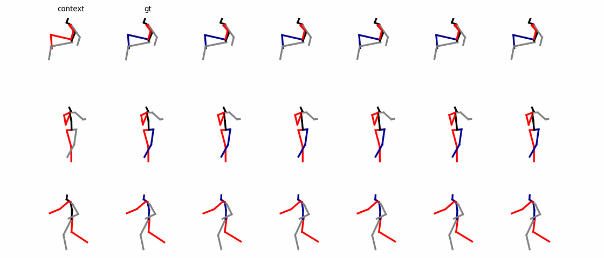
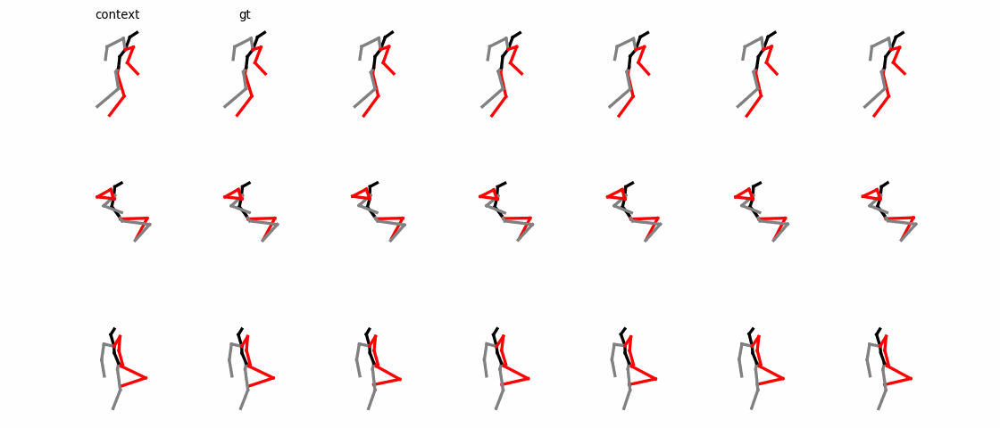

# ICCV 2023 HumanMAC

Code for "HumanMAC: Masked Motion Completion for Human Motion Prediction".

[Ling-Hao Chen](https://lhchen.top/)\*<sup>1</sup>, Jiawei Zhang\*<sup>2</sup>, [Yewen Li](https://scholar.google.com/citations?user=W5796yEAAAAJ)<sup>3</sup>, [Yiren Pang](https://www.linkedin.com/in/yrpang/)<sup>2</sup>, [Xiaobo Xia](https://xiaoboxia.github.io/)<sup>4</sup>, [Tongliang Liu](https://tongliang-liu.github.io/)<sup>4</sup>

<sup>1</sup>Tsinghua University, <sup>2</sup>Xidian University, <sup>3</sup>Nanyang Technological University, <sup>4</sup>The University of Sydney

[[Project Page](https://lhchen.top/Human-MAC/)] | [[Preprint](https://arxiv.org/abs/2302.03665)] | [[中文文档](doc-CN/README.md)] | [[video](https://www.youtube.com/watch?v=vfde9GdUHBs)] | [[code](https://github.com/LinghaoChan/HumanMAC)]

> Human motion prediction is a classical problem in computer vision and computer graphics, which has a wide range of practical applications. Previous effects achieve great empirical performance based on an encoding-decoding style. The methods of this style work by first encoding previous motions to latent representations and then decoding the latent representations into predicted motions. However, in practice, they are still unsatisfactory due to several issues, including complicated loss constraints, cumbersome training processes, and scarce switch of different categories of motions in prediction. In this paper, to address the above issues, we jump out of the foregoing style and propose a novel framework from a new perspective. Specifically, our framework works in a denoising diffusion style. In the training stage, we learn a motion diffusion model that generates motions from random noise. In the inference stage, with a denoising procedure, we make motion prediction conditioning on observed motions to output more continuous and controllable predictions. The proposed framework enjoys promising algorithmic properties, which only needs one loss in optimization and is trained in an end-to-end manner. Additionally, it accomplishes the switch of different categories of motions effectively, which is significant in realistic tasks, e.g., the animation task. Comprehensive experiments on benchmarks confirm the superiority of the proposed framework. The project page is available at https://lhchen.top/Human-MAC.

## 📢 News

**[2023/12/19]: HumanMAC works as a motion prediction module in [Interactive Humanoid](https://arxiv.org/pdf/2312.08983.pdf).**

**[2023/10/21]: Check out my latest work [HumanTOMATO](https://lhchen.top/HumanTOMATO), the FIRST attempt to generate whole-body motions with text description.**

**[2023/10/17]: Check out my latest open-source project [UniMoCap](https://github.com/LinghaoChan/UniMoCap), a unifier for mocap-based text-motion datasets.**

**[2023/07/14]: HumanMAC is accepted by ICCV 2023!**

**[2023/03/26]: HumanMAC code released!**

## 🗂️ Preparation

### Data

**Datasets for [Human3.6M](http://vision.imar.ro/human3.6m/description.php) and [HumanEva-I](http://humaneva.is.tue.mpg.de/)**:

We adopt the data preprocessing from [GSPS](https://github.com/wei-mao-2019/gsps), which you can refer to [here](https://drive.google.com/drive/folders/1sb1n9l0Na5EqtapDVShOJJ-v6o-GZrIJ) and download all files into the `./data` directory.

**Dataset for zero-shot experiments on [AMASS](https://amass.is.tue.mpg.de/)**:

We retarget skeletons in the AMASS dataset to the Human3.6M dataset. We provide a small subset retargeted AMASS motion here. The retargeted sub-dataset can be downloaded from [Google Drive](https://drive.google.com/file/d/1ysXf0rpxNqx3FScIf5hkk7JIyM_54aLW/view) ([Baidu Netdisk](https://pan.baidu.com/s/1vljNdr7CwBgYlF2QX8S5EA?pwd=qnue)). And put it in the `./data` directory. The retargeting process is detailed in [`./motion-retargeting`](./motion-retargeting).

Final `./data` directory structure is shown below:

```
data
├── amass_retargeted.npy
├── data_3d_h36m.npz
├── data_3d_h36m_test.npz
├── data_3d_humaneva15.npz
├── data_3d_humaneva15_test.npz
├── data_multi_modal
│   ├── data_candi_t_his25_t_pred100_skiprate20.npz
│   └── t_his25_1_thre0.500_t_pred100_thre0.100_filtered_dlow.npz
└── humaneva_multi_modal
    ├── data_candi_t_his15_t_pred60_skiprate15.npz
    └── t_his15_1_thre0.500_t_pred60_thre0.010_index_filterd.npz
```

### Pretrained Model

To make the visualization of HumanMAC's various abilities convenient, we provide pretrained model [Google Drive](https://drive.google.com/file/d/1Jah4aIbrsSRTBqSxzT-MI55fD62PGxCT/view?usp=sharing)  ([Baidu Netdisk](https://pan.baidu.com/s/1kX88ya6J7j-pG46Se12Xkg?pwd=haj8)) on Human3.6M. The pretrained model need to be put in the `./checkpoints` directory.

### Environment Setup

```
sh install.sh
```

## 🔧 Training

For Human3.6M:

```
python main.py --cfg h36m --mode train
```

For HumanEva-I:

```
python main.py --cfg humaneva --mode train
```

After running the command, a directory named `<DATASET>_<INDEX> ` is created in the `./results` directory (`<DATASET>` in `{'h36m', 'humaneva'}`, `<INDEX>` is equal to the number of directories in `./results`). During the training process, the `gif`s are stored in `./<DATASET>_<INDEX>/out`, log files are stored in `./<DATASET>_<INDEX>/log`, model checkpoints are stored in `./<DATASET>_<INDEX>/models`, and metrics are stored in `./<DATASET>_<INDEX>/results`.

## 📽 Visualization of Motion Prediction



For Human3.6M:

```
python main.py --cfg h36m --mode pred --vis_row 3 --vis_col 10 --ckpt ./checkpoints/h36m_ckpt.pt
```

For HumanEva-I:

```
python main.py --cfg humaneva --mode pred --vis_row 3 --vis_col 10 --ckpt ./checkpoints/humaneva_ckpt.pt
```

`vis_row` and `vis_col` represent the number of rows and columns of the drawn `gif`s respectively. There are two `gif`s for each category of motions in the`<DATASET>`, each `gif` contains `vis_row` motions, and each motion has `vis_col` candidate predictions. Those `gif`s can be found at `./inference/<DATASET>_<INDEX>/out`.

## 🔀 Motion Switch


Visualization of switch ability: 

```
python main.py --mode switch --ckpt ./checkpoints/h36m_ckpt.pt
```

The `vis_switch_num` `gif`s will be stored in `. /inference/switch_<INDEX>/out`. Each `gif` contains 30 motions, and these motions will eventually switch to one of them.

## 🕹️ Controllable Motion Prediction



Visualization of controllable motion prediction: 

```
python main.py --mode control --ckpt ./checkpoints/h36m_ckpt.pt
```

7 `gif`s will be stored in `. /inference/<CONTROL>_<INDEX>/out`, each `gif` has `vis_row` motions and each motion has `vis_col` candidate predictions. `<CONTROL>` corresponds to `{'right_leg', 'left_leg', 'torso', 'left_arm', 'right_arm', 'fix_lower', 'fix_upper'}`.

## 🎯 Zero-shot Prediction on AMASS



Visualization of zero-shot on the AMASS dataset:

```
python main.py --mode zero_shot --ckpt ./checkpoints/h36m_ckpt.pt
```

The `gif`s of the zero-shot experiment will be stored in `./inference/zero_shot_<INDEX>/out`, with the same number of motions set by `vis_col` and `vis_row`.

## 🧐 Evaluation

Evaluate on Human3.6M:

```
python main.py --cfg h36m --mode eval --ckpt ./checkpoints/h36m_ckpt.pt
```

Evaluate on HumanEva-I:

```
python main.py --cfg humaneva --mode eval --ckpt ./checkpoints/humaneva_ckpt.pt
```

**Note**: We parallelize the process of evaluating metrics (APD, ADE, FDE, MMADE, and MMFDE) to speed up the process, so this part is strictly require GPU.

## 🌹 Acknowledgments

We would like to thank Mr. Yu-Kun Zhou from Xidian University, and Mr. [Wenhao Yang](http://www.lamda.nju.edu.cn/yangwh/) from Nanjing University for providing significant suggestions and technical support.

Part of the code is borrowed from the [DLow](https://github.com/Khrylx/DLow) and [GSPS](https://github.com/wei-mao-2019/gsps) repo.

## 📚 License

This code is distributed under an [MIT LICENSE](https://github.com/LinghaoChan/HumanMAC/blob/main/LICENSE). Note that our code depends on other libraries and datasets which each have their own respective licenses that must also be followed.

## 🤝 Citation

Please consider citing our paper if you find it helpful in your research:

```
@inproceedings{chen2023humanmac,
	title={HumanMAC: Masked Motion Completion for Human Motion Prediction},
	author={Chen, Ling-Hao and Zhang, Jiawei and Li, Yewen and Pang, Yiren and Xia, Xiaobo and Liu, Tongliang},
	journal={Proceedings of the IEEE/CVF International Conference on Computer Vision (ICCV)},
	year={2023}
}
```

## 🌟 Star History

<p align="center">
    <a href="https://star-history.com/#LinghaoChan/HumanMAC&Date" target="_blank">
        
    </a>
<p>


Contact at: thu DOT lhchen AT gmail DOT com
